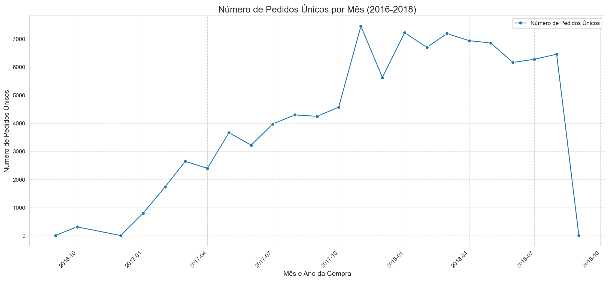
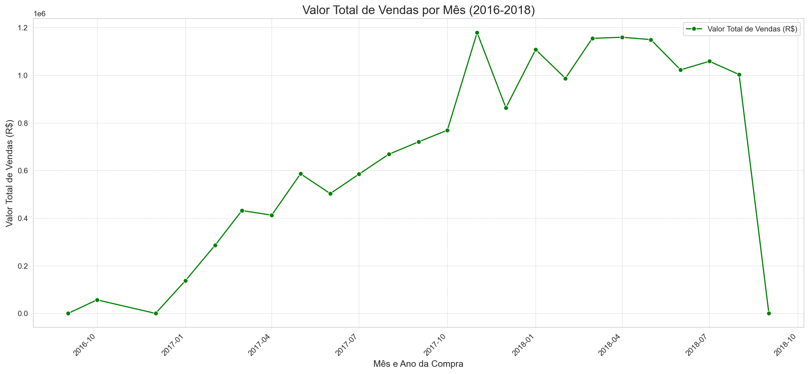
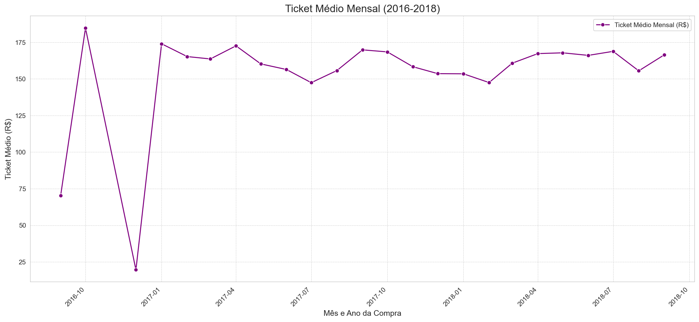
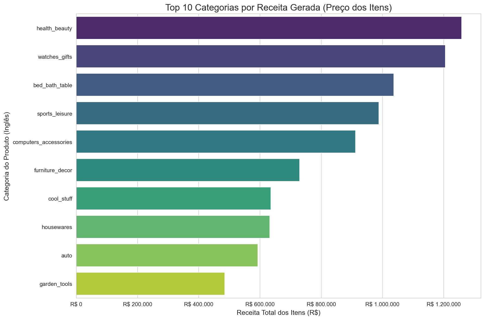
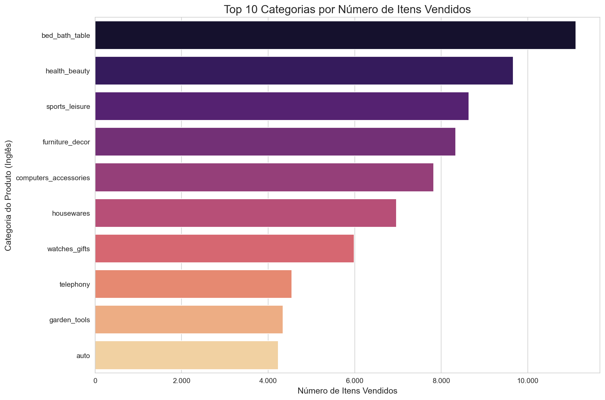
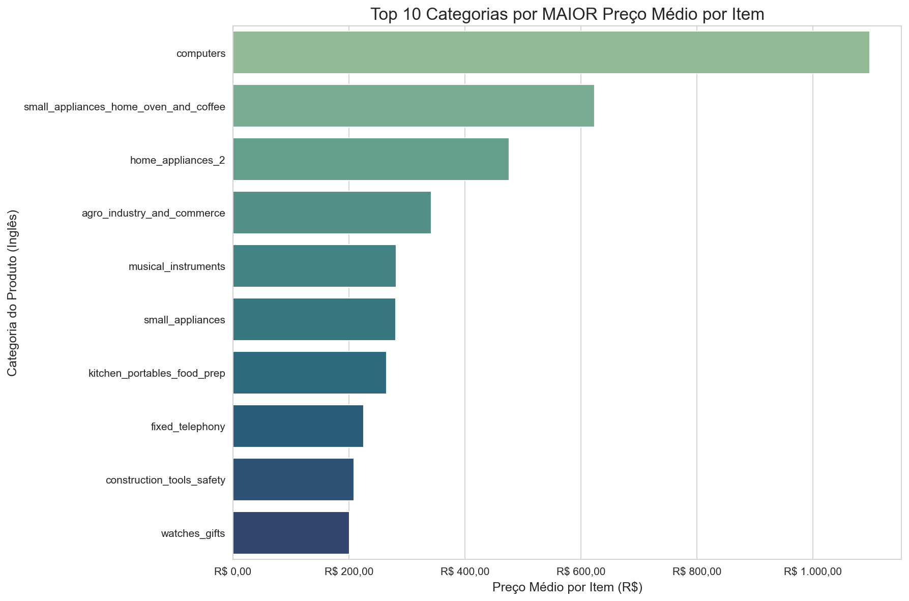
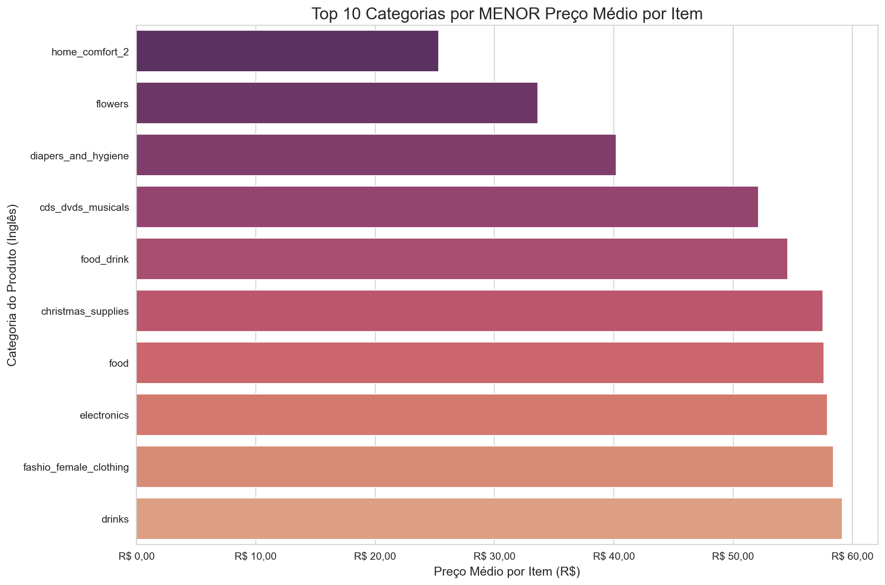
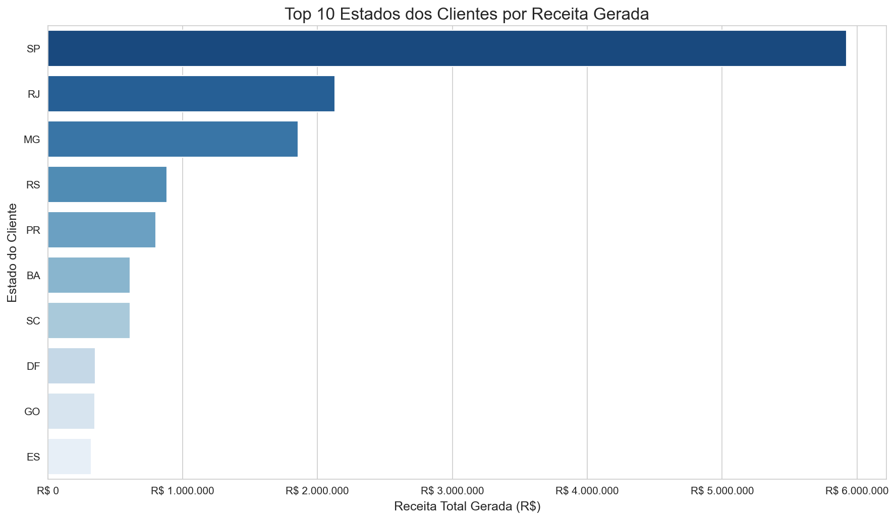
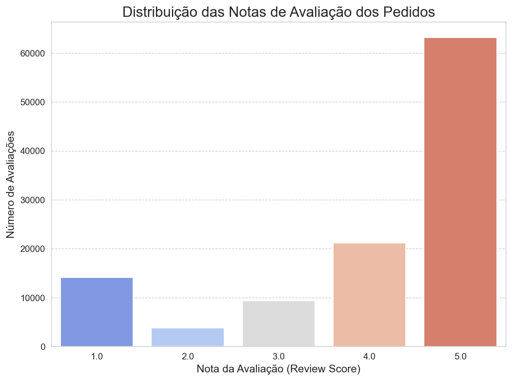

# 📊 Análise Exploratória de Dados do E-commerce Olist 🛍️

Bem-vindo à análise exploratória de dados do dataset público da Olist! Este projeto tem como objetivo investigar os dados de vendas de um grande e-commerce brasileiro para extrair dados sobre tendências de vendas, desempenho de produtos, comportamento de clientes e distribuição geográfica das operações.

## 🎯 Objetivos da Análise
* Entender a evolução das vendas e do **ticket médio** ao longo do tempo. O ticket médio é um indicador importante que representa o valor médio gasto por cliente em cada pedido.
* Identificar as categorias de produtos mais relevantes em termos de receita e volume.
* Analisar as características de preço das diferentes categorias de produtos.
* Mapear os principais estados e cidades que geram receita para o e-commerce.
* Aplicar técnicas de limpeza, pré-processamento e junção de dados para preparar um dataset consolidado para análise.

## 💾 Fonte dos Dados

Os dados utilizados neste projeto são do **"Brazilian E-Commerce Public Dataset by Olist"**, um conjunto de dados público e anonimizado disponibilizado no Kaggle. 

A **Olist** é uma empresa brasileira que conecta pequenos e médios lojistas aos grandes canais de venda do país (marketplaces), funcionando como uma grande loja de departamento virtual. Os dados, portanto, refletem transações de e-commerce realizadas através da plataforma Olist, abrangendo uma vasta gama de produtos e interações com clientes em todo o Brasil.

O dataset é composto por múltiplos arquivos CSV interconectados, incluindo informações sobre:
* `olist_customers_dataset.csv`: Dados dos clientes e sua localização.
* `olist_geolocation_dataset.csv`: Informações de geolocalização (latitude/longitude por CEP).
* `olist_orders_dataset.csv`: Dados dos pedidos, incluindo status e datas.
* `olist_order_items_dataset.csv`: Detalhes dos itens dentro de cada pedido, incluindo preço e vendedor.
* `olist_order_payments_dataset.csv`: Informações sobre as transações de pagamento dos pedidos.
* `olist_order_reviews_dataset.csv`: Avaliações (notas e comentários) feitas pelos clientes.
* `olist_products_dataset.csv`: Informações sobre os produtos vendidos.
* `olist_sellers_dataset.csv`: Dados dos vendedores que comercializam através da Olist.
* `product_category_name_translation.csv`: Tradução dos nomes das categorias de produtos para o inglês.

Você pode encontrar o dataset original aqui: [Brazilian E-Commerce Public Dataset by Olist no Kaggle](https://www.kaggle.com/datasets/olistbr/brazilian-ecommerce)

## 🛠️ Ferramentas Utilizadas
* **Linguagem de Programação:** Python 3
* **Principais Bibliotecas Python:**
    * Pandas: Para manipulação e análise de dados tabulares.
    * NumPy: Para operações numéricas.
    * Matplotlib: Para criação de gráficos estáticos.
    * Seaborn: Para visualizações estatísticas mais elaboradas.
* **Ambiente de Desenvolvimento:** Jupyter Notebooks (utilizado através do Visual Studio Code).

## 📁 Estrutura do Projeto
O repositório está organizado da seguinte forma:
* `README.md`: Este arquivo, com a descrição geral do projeto e os principais achados.
* `dados/`: Contém os arquivos `.csv` originais do dataset da Olist e o DataFrame processado (`olist_df_merged_para_analise.csv`) utilizado na análise exploratória.
* `notebooks/` (ou os nomes dos seus arquivos `.ipynb` se estiverem na raiz):
    * `01_exploracao_inicial.ipynb`: Notebook com a exploração inicial de cada tabela do dataset.
    * `02_limpeza_dados.ipynb`: Notebook detalhando o processo de limpeza, pré-processamento e junção das tabelas.
    * `03_analise_exploratoria.ipynb`: Notebook com a análise exploratória de dados (EDA) e a geração dos dados e visualizações.
* `visualizacoes/`: Contém os gráficos gerados durante a EDA e salvos como arquivos de imagem (`.png`).
* `requirements.txt`: Arquivo listando as dependências de bibliotecas Python do projeto (vamos criar este arquivo ao final).

## ⚙️ Visão Geral do Processo de Análise

O projeto foi desenvolvido seguindo as seguintes etapas principais:

1.  **Exploração Inicial dos Dados:**
    * Carregamento individual de cada um dos 9 arquivos CSV do dataset.
    * Análise preliminar da estrutura, tipos de dados, volumes e identificação de chaves de cada tabela para entender seu conteúdo e as relações entre elas.

2.  **Limpeza e Pré-processamento dos Dados:**
    * Conversão de colunas de data/hora para o formato `datetime` em todas as tabelas relevantes.
    * Tratamento de valores ausentes (NaNs) em diversas colunas, como categorias de produtos, atributos de produtos e informações de pagamento, utilizando estratégias como preenchimento com valores padrão (ex: "desconhecida" para categorias) ou medianas.
    * Investigação e correção de valores anômalos, como produtos com peso zero e transações de pagamento com valor zero ou número de parcelas inválido para o tipo de pagamento.
    * Adição de traduções para os nomes das categorias de produtos (Português para Inglês).
    * Deduplicação de registros de avaliação de pedidos para garantir uma única avaliação por pedido.

3.  **Junção das Tabelas:**
    * Criação de um DataFrame consolidado (`df_merged`) através da junção progressiva das tabelas individuais limpas, utilizando as chaves apropriadas (`order_id`, `product_id`, `customer_id`, `seller_id`). Foram realizados merges para integrar dados de pedidos, itens, produtos, clientes, vendedores, informações de pagamento agregadas e avaliações.

4.  **Análise Exploratória de Dados (EDA):**
    * Extração de dados a partir do DataFrame consolidado, focando em:
        * Tendências temporais de vendas (volume de pedidos, receita total e ticket médio mensal).
        * Desempenho das categorias de produtos (por receita, volume de itens vendidos e preço médio por item).
        * Distribuição geográfica da receita gerada pelos clientes (por estado e cidade).
    * Geração de visualizações (gráficos de linha e barras) para ilust

## 💡 Principais Achados e dados da Análise

Nesta seção, apresentamos as descobertas mais relevantes obtidas através da análise exploratória dos dados do e-commerce Olist.

### 📈 1. Evolução das Vendas ao Longo do Tempo

Analisamos como o número de pedidos, o valor total das vendas e o ticket médio mensal se comportaram durante o período coberto pelo dataset (aproximadamente de Setembro de 2016 a Agosto de 2018, com dados parciais para Setembro de 2018).

**Número de Pedidos Únicos por Mês:**
Observou-se um início modesto em 2016, seguido por um crescimento expressivo no volume de pedidos ao longo de 2017, atingindo um patamar elevado e mais estável em 2018.

**Valor Total de Vendas por Mês:**
A receita total acompanhou de perto a tendência do número de pedidos, mostrando um aumento significativo em 2017 e alcançando os maiores picos de faturamento em 2018.

*Nota: Os meses de Setembro de 2016, Dezembro de 2016 e Setembro de 2018 apresentaram volumes de dados atipicamente baixos ou parciais e devem ser interpretados com essa ressalva.*

**Ticket Médio Mensal:**
O valor médio gasto por pedido, após um período inicial com maior volatilidade (devido ao baixo volume de transações), tendeu a se estabilizar. Durante os meses de maior volume de vendas em 2017 e 2018, o ticket médio flutuou principalmente na faixa de R$ 155 a R$ 175.

---

### 🛍️ 2. Desempenho das Categorias de Produtos

A análise das categorias de produtos revelou quais segmentos são mais importantes para o e-commerce, tanto em termos de receita gerada quanto em volume de vendas e preço médio dos itens.

**Top Categorias por Receita Gerada:**
As categorias `health_beauty`, `watches_gifts` e `bed_bath_table` lideram a geração de receita proveniente do preço dos itens.

**Top Categorias por Número de Itens Vendidos:**
Em termos de volume, `bed_bath_table`, `health_beauty` e `sports_leisure` são as que mais vendem unidades.

**Categorias por Preço Médio por Item:**
Categorias como `computers` e `small_appliances_home_oven_and_coffee` se destacam por terem os itens com maior preço médio. Por outro lado, a categoria `electronics` apresentou um preço médio surpreendentemente baixo.

**

---

### 🗺️ 3. Distribuição Geográfica da Receita (Clientes)

A análise da localização dos clientes revelou importantes concentrações geográficas na geração de receita para o e-commerce.

**Receita por Estado do Cliente:**
O estado de São Paulo (SP) destaca-se como o principal mercado, respondendo pela maior parcela da receita, seguido por Rio de Janeiro (RJ) e Minas Gerais (MG).

**Receita por Cidade do Cliente:**
Aprofundando a análise, a cidade de São Paulo é a que mais contribui individualmente para a receita, seguida pela cidade do Rio de Janeiro e Belo Horizonte.

---

### ⭐ 4. Satisfação do Cliente (Observação Geral)

A análise das avaliações dos pedidos (`review_score`) indicou uma tendência geral positiva, com uma mediana de 5.0 e média em torno de 4.03, sugerindo que a maioria dos clientes que deixaram avaliações tiveram uma experiência satisfatória.

---

## 🔗 Para Detalhes da Análise e Código

Todo o processo de análise, desde a exploração inicial dos dados, passando pela limpeza, pré-processamento, junção das tabelas e a análise exploratória detalhada, está documentado nos seguintes notebooks Jupyter presentes neste repositório:

* **`01_exploracao_inicial.ipynb`**: Contém a primeira olhada em cada um dos arquivos do dataset, verificando estrutura, tipos de dados e informações básicas.
* **`02_limpeza_dados.ipynb`**: Detalha todas as etapas de limpeza de dados (tratamento de valores ausentes, correção de tipos, tratamento de anomalias) e o processo de junção das diversas tabelas para a criação do DataFrame consolidado (`df_merged`).
* **`03_analise_exploratoria.ipynb`**: Apresenta a análise exploratória de dados (EDA) realizada sobre o DataFrame consolidado, incluindo a geração de todos os gráficos e a extração dos dados discutidos.

Sinta-se à vontade para explorar os notebooks para um entendimento completo da metodologia aplicada.

## 🏁 Conclusões

Esta análise exploratória do dataset da Olist permitiu extrair diversos dados valiosos sobre a operação de um grande e-commerce brasileiro. As principais conclusões incluem:

* 📈 **Crescimento Significativo:** O e-commerce demonstrou uma clara trajetória de crescimento ao longo do período analisado (2017-2018), tanto em volume de pedidos quanto em receita, após um início mais modesto em 2016.
* 💰 **Concentração de Receita:** Há uma forte concentração geográfica da receita no estado de São Paulo e na região Sudeste, com as grandes capitais liderando o consumo.
* 🛍️ **Categorias Chave:** Categorias como `health_beauty`, `watches_gifts`, e `bed_bath_table` são cruciais para a receita, enquanto `bed_bath_table` lidera em volume. A análise de preço médio por item revelou nichos de alto valor (ex: `computers`) e categorias com itens de menor custo unitário e alto volume (ex: `electronics` focada em acessórios).
* 👍 **Satisfação Geral Positiva:** As avaliações dos clientes indicam, em sua maioria, uma experiência de compra positiva.
* 📊 **Importância da Limpeza de Dados:** O processo de limpeza e pré-processamento foi fundamental para garantir a qualidade e a confiabilidade das análises realizadas.

Este projeto demonstra a aplicação prática de técnicas de análise de dados para entender a dinâmica de um negócio de e-commerce e identificar oportunidades a partir de dados transacionais.

## 🚀 Possíveis Próximos Passos / Análises Futuras

Embora esta análise tenha fornecido muitos dados, existem diversas oportunidades para aprofundamento e expansão do projeto:

* **Análise de Sentimento:** Aplicar técnicas de Processamento de Linguagem Natural (NLP) nos comentários textuais das avaliações (`review_comment_message`) para obter uma compreensão mais qualitativa da satisfação do cliente.
* **Segmentação de Clientes (RFM):** Criar segmentos de clientes com base em seu comportamento de compra (Recência, Frequência, Valor Monetário) para direcionar estratégias de marketing personalizadas.
* **Análise de Churn de Clientes:** Tentar identificar padrões que levam à perda de clientes.
* **Modelagem Preditiva:** Desenvolver modelos para prever vendas futuras, demanda por produtos ou categorias.
* **Análise Logística Detalhada:** Investigar a fundo os tempos de entrega por região, a relação com a satisfação do cliente e o impacto dos custos de frete.
* **Market Basket Analysis:** Identificar quais produtos são frequentemente comprados juntos.

